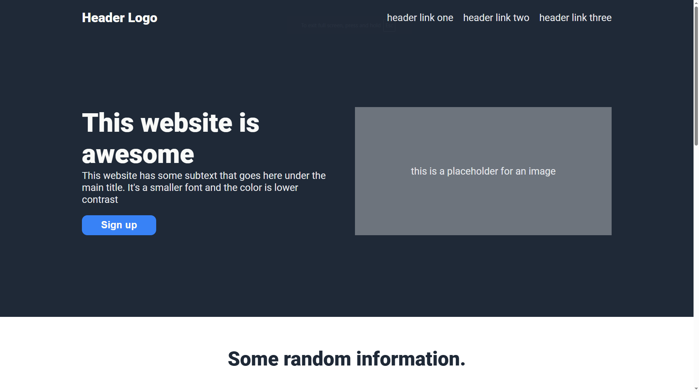

# 🌐 Landing page

This is the second project from [The Odin Project](https://github.com/TheOdinProject) curriculum — a simple landing page designed to practice layout and styling with HTML and CSS

## ✨ Preview

## 🛠️ Skills Learned

### 📦 Flexbox

- Position elements using flexbox.
- Flex containers and flex items.
- Growing and Shrinking
- Axes
- Alignment

### 🎨 CSS Foundations

- Add styles to HTML with CSS.
- Understand how to use the class and ID attributes.
- Add styles to specific elements using the correct selectors.
- The Cascade
- Inspecting HTML and CSS
- The Box Model
- Block and Inline
